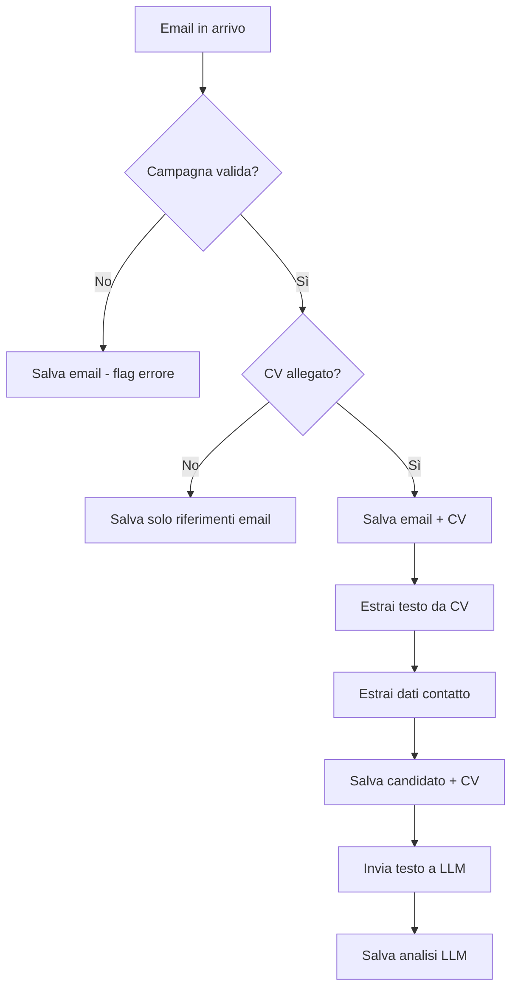

# Piano di Realizzazione: Sistema di Analisi CV via Email

Sistema Laravel per la gestione automatica di email di recruiting con analisi CV tramite LLM.

## Architettura Generale

### Flusso di Elaborazione


## Schema Database

### Tabelle Principali

#### `campaigns`
- `id` - bigint PK
- `name` - string
- `email_prefix` - string (es: "job", "careers")
- `status` - enum(active, paused, closed)
- `created_at`, `updated_at`

#### `received_emails`
- `id` - bigint PK
- `campaign_id` - bigint FK nullable
- `from_email` - string
- `from_name` - string nullable
- `subject` - string
- `body_text` - text
- `body_html` - text nullable
- `has_resume` - boolean default false
- `processed_at` - timestamp nullable
- `error_message` - text nullable
- `raw_email` - longtext (email completo)
- `created_at`

#### `candidates`
- `id` - bigint PK
- `first_name` - string
- `last_name` - string
- `email` - string unique
- `phone` - string nullable
- `linkedin_url` - string nullable
- `github_url` - string nullable
- `other_social` - json nullable
- `created_at`, `updated_at`

#### `resumes`
- `id` - bigint PK
- `candidate_id` - bigint FK
- `received_email_id` - bigint FK
- `campaign_id` - bigint FK
- `original_filename` - string
- `file_path` - string
- `file_type` - string (pdf, docx, etc.)
- `file_size` - integer
- `extracted_text` - longtext
- `extraction_method` - string (python, php)
- `created_at`, `updated_at`

#### `resume_analyses`
- `id` - bigint PK
- `resume_id` - bigint FK
- `candidate_id` - bigint FK
- `llm_provider` - string (openai, anthropic, etc.)
- `llm_model` - string
- `analysis_json` - json (skills, experience, education, summary)
- `skills_assessment` - json (technical, soft skills con score)
- `overall_score` - decimal(3,2) nullable
- `analysis_summary` - text
- `processing_time_ms` - integer
- `created_at`

## Componenti Tecnici

### 1. Ricezione Email

**Strategia raccomandata**: Mailgun/Postmark webhook o server IMAP locale

#### Opzione A: Webhook (Mailgun/Postmark)
```php
// routes/web.php
Route::post('/webhooks/inbound-email', [InboundEmailController::class, 'handle']);

// app/Http/Controllers/InboundEmailController.php
public function handle(Request $request)
{
    ProcessInboundEmail::dispatch($request->all());
    return response()->json(['status' => 'queued']);
}
```

#### Opzione B: IMAP (Laravel-IMAP package)
```bash
composer require webklex/laravel-imap
```

```php
// app/Console/Commands/FetchEmails.php
public function handle()
{
    $client = Client::account('default');
    $client->connect();
    
    $folder = $client->getFolder('INBOX');
    $messages = $folder->messages()->unseen()->get();
    
    foreach ($messages as $message) {
        ProcessInboundEmail::dispatch($message);
    }
}
```

### 2. Estrazione ID Campagna

**Strategia**: Pattern matching sull'indirizzo email destinatario

```php
// app/Services/CampaignResolver.php
class CampaignResolver
{
    public function resolveFromEmail(string $toEmail): ?Campaign
    {
        // Es: job-123@domain.com -> campaign_id = 123
        // Es: careers+frontend@domain.com -> campagna "frontend"
        
        preg_match('/(\w+)[-+]?(\w+)?@/', $toEmail, $matches);
        
        $prefix = $matches[1];
        $identifier = $matches[2] ?? null;
        
        return Campaign::where('email_prefix', $prefix)
            ->where(function($q) use ($identifier) {
                if ($identifier) {
                    $q->where('id', $identifier)
                      ->orWhere('slug', $identifier);
                }
            })
            ->first();
    }
}
```

### 3. Estrazione Testo da CV

**Raccomandazione**: Python con `pdfminer.six` e `python-docx` (più potente)

```python
# app/Python/extract_resume_text.py
import sys
import json
from pdfminer.high_level import extract_text as extract_pdf
from docx import Document

def extract_text(file_path):
    ext = file_path.split('.')[-1].lower()
    
    if ext == 'pdf':
        return extract_pdf(file_path)
    elif ext in ['docx', 'doc']:
        doc = Document(file_path)
        return '\n'.join([para.text for para in doc.paragraphs])
    else:
        raise ValueError(f"Unsupported format: {ext}")

if __name__ == "__main__":
    file_path = sys.argv[1]
    text = extract_text(file_path)
    print(json.dumps({"text": text}))
```

```php
// app/Services/ResumeTextExtractor.php
class ResumeTextExtractor
{
    public function extract(string $filePath): string
    {
        $pythonScript = base_path('app/Python/extract_resume_text.py');
        $output = shell_exec("python3 {$pythonScript} {$filePath}");
        
        $result = json_decode($output, true);
        return $result['text'] ?? '';
    }
}
```

### 4. Estrazione Dati Contatto

```php
// app/Services/ContactExtractor.php
class ContactExtractor
{
    public function extract(string $text): array
    {
        return [
            'email' => $this->extractEmail($text),
            'phone' => $this->extractPhone($text),
            'name' => $this->extractName($text),
            'linkedin' => $this->extractLinkedIn($text),
            'github' => $this->extractGitHub($text),
        ];
    }
    
    private function extractEmail(string $text): ?string
    {
        preg_match('/[\w\.-]+@[\w\.-]+\.\w+/', $text, $matches);
        return $matches[0] ?? null;
    }
    
    private function extractPhone(string $text): ?string
    {
        // Pattern per numeri italiani/internazionali
        preg_match('/(\+39|0039)?\s?3\d{2}[\s\-]?\d{6,7}/', $text, $matches);
        return $matches[0] ?? null;
    }
    
    private function extractLinkedIn(string $text): ?string
    {
        preg_match('/linkedin\.com\/in\/[\w\-]+/', $text, $matches);
        return $matches[0] ?? null;
    }
    
    private function extractGitHub(string $text): ?string
    {
        preg_match('/github\.com\/[\w\-]+/', $text, $matches);
        return $matches[0] ?? null;
    }
    
    private function extractName(string $text): ?array
    {
        // Logica più complessa - potrebbe usare NLP
        // Per ora, cerca pattern comuni nelle prime righe
        $lines = explode("\n", $text);
        $firstLine = trim($lines[0] ?? '');
        
        $parts = explode(' ', $firstLine);
        return [
            'first_name' => $parts[0] ?? null,
            'last_name' => $parts[1] ?? null,
        ];
    }
}
```

### 5. Integrazione LLM

```php
// app/Services/ResumeAnalyzer.php
class ResumeAnalyzer
{
    public function analyze(Resume $resume): array
    {
        $anonymizedText = $this->removePersonalInfo($resume->extracted_text);
        
        $prompt = <<<PROMPT
Analizza il seguente CV e restituisci un JSON con questa struttura:
{
  "skills": {
    "technical": ["skill1", "skill2"],
    "soft": ["skill1", "skill2"]
  },
  "experience_years": 5,
  "education": [{"degree": "", "institution": "", "year": 2020}],
  "languages": [{"name": "English", "level": "C1"}],
  "summary": "Breve sintesi professionale",
  "strengths": ["punto di forza 1", "punto di forza 2"],
  "skill_assessment": {
    "technical_score": 0.85,
    "experience_score": 0.75,
    "overall_fit": 0.80
  }
}

CV:
{$anonymizedText}
PROMPT;

        $response = OpenAI::chat()->create([
            'model' => 'gpt-4-turbo-preview',
            'messages' => [
                ['role' => 'system', 'content' => 'You are an expert HR recruiter analyzing resumes.'],
                ['role' => 'user', 'content' => $prompt],
            ],
            'response_format' => ['type' => 'json_object'],
        ]);
        
        return json_decode($response->choices[0]->message->content, true);
    }
    
    private function removePersonalInfo(string $text): string
    {
        // Rimuovi email, telefoni, indirizzi
        $text = preg_replace('/[\w\.-]+@[\w\.-]+\.\w+/', '[EMAIL]', $text);
        $text = preg_replace('/(\+39|0039)?\s?3\d{2}[\s\-]?\d{6,7}/', '[PHONE]', $text);
        return $text;
    }
}
```

### 6. Job di Elaborazione Principale

```php
// app/Jobs/ProcessInboundEmail.php
class ProcessInboundEmail implements ShouldQueue
{
    use Dispatchable, InteractsWithQueue, Queueable, SerializesModels;
    
    public function handle(
        CampaignResolver $campaignResolver,
        ResumeTextExtractor $textExtractor,
        ContactExtractor $contactExtractor,
        ResumeAnalyzer $analyzer
    ) {
        DB::beginTransaction();
        
        try {
            // 1. Salva email
            $email = ReceivedEmail::create([
                'from_email' => $this->data['from'],
                'subject' => $this->data['subject'],
                'body_text' => $this->data['text'],
                'raw_email' => json_encode($this->data),
            ]);
            
            // 2. Risolvi campagna
            $campaign = $campaignResolver->resolveFromEmail($this->data['to']);
            $email->update(['campaign_id' => $campaign?->id]);
            
            // 3. Verifica allegato CV
            $resumeAttachment = $this->findResumeAttachment($this->data['attachments'] ?? []);
            
            if (!$resumeAttachment) {
                $email->update(['has_resume' => false, 'processed_at' => now()]);
                DB::commit();
                return;
            }
            
            // 4. Salva file CV
            $filePath = Storage::putFile('resumes', $resumeAttachment);
            
            // 5. Estrai testo
            $text = $textExtractor->extract(Storage::path($filePath));
            
            // 6. Estrai dati contatto
            $contactData = $contactExtractor->extract($text);
            
            // 7. Crea/aggiorna candidato
            $candidate = Candidate::updateOrCreate(
                ['email' => $contactData['email']],
                [
                    'first_name' => $contactData['name']['first_name'],
                    'last_name' => $contactData['name']['last_name'],
                    'phone' => $contactData['phone'],
                    'linkedin_url' => $contactData['linkedin'],
                    'github_url' => $contactData['github'],
                ]
            );
            
            // 8. Salva CV
            $resume = Resume::create([
                'candidate_id' => $candidate->id,
                'received_email_id' => $email->id,
                'campaign_id' => $campaign?->id,
                'file_path' => $filePath,
                'extracted_text' => $text,
                'extraction_method' => 'python',
            ]);
            
            // 9. Analizza con LLM (async)
            AnalyzeResume::dispatch($resume);
            
            $email->update(['has_resume' => true, 'processed_at' => now()]);
            
            DB::commit();
            
        } catch (\Exception $e) {
            DB::rollBack();
            $email->update(['error_message' => $e->getMessage()]);
            throw $e;
        }
    }
    
    private function findResumeAttachment(array $attachments): ?array
    {
        $resumeExtensions = ['pdf', 'doc', 'docx'];
        
        foreach ($attachments as $attachment) {
            $ext = strtolower(pathinfo($attachment['filename'], PATHINFO_EXTENSION));
            if (in_array($ext, $resumeExtensions)) {
                return $attachment;
            }
        }
        
        return null;
    }
}
```

```php
// app/Jobs/AnalyzeResume.php
class AnalyzeResume implements ShouldQueue
{
    public function handle(ResumeAnalyzer $analyzer)
    {
        $startTime = microtime(true);
        
        $analysis = $analyzer->analyze($this->resume);
        
        ResumeAnalysis::create([
            'resume_id' => $this->resume->id,
            'candidate_id' => $this->resume->candidate_id,
            'llm_provider' => 'openai',
            'llm_model' => 'gpt-4-turbo-preview',
            'analysis_json' => $analysis,
            'skills_assessment' => $analysis['skill_assessment'] ?? [],
            'overall_score' => $analysis['skill_assessment']['overall_fit'] ?? null,
            'analysis_summary' => $analysis['summary'] ?? '',
            'processing_time_ms' => (microtime(true) - $startTime) * 1000,
        ]);
    }
}
```

## Miglioramenti Suggeriti

### 1. **Sistema di Scoring Avanzato**
- Matching percentuale con job description della campagna
- Ranking automatico dei candidati per campagna
- Alert per candidati ad alto potenziale

### 2. **Dashboard Admin**
- Vista campagne attive con statistiche
- Lista candidati con filtri e ordinamento
- Dettaglio candidato con CV originale e analisi LLM
- Export dati in Excel/CSV

### 3. **Notifiche**
- Email al recruiter quando arriva CV ad alto score
- Slack/Teams integration
- Digest giornaliero

### 4. **API REST**
- Endpoint per integrare con ATS esistenti
- Webhook per eventi (nuovo CV, analisi completata)

### 5. **Sicurezza e Privacy (GDPR)**
- Crittografia file CV a riposo
- Log accessi ai dati sensibili
- Retention policy automatica
- Funzione di anonimizzazione dati

### 6. **Miglioramenti Estrazione Dati**
- Utilizzo di NER (Named Entity Recognition) con spaCy per nomi
- OCR per CV scansionati (Tesseract)
- Supporto formati aggiuntivi (txt, rtf, odt)

### 7. **Cache e Performance**
- Cache analisi LLM per CV duplicati (hash contenuto)
- Queue prioritizzate (campagne urgenti)
- Ottimizzazione storage (compressione file vecchi)

## Stack Tecnologico Consigliato

- **Backend**: Laravel 11
- **Database**: PostgreSQL (meglio per JSON)
- **Queue**: Redis + Laravel Horizon
- **Storage**: S3/MinIO per CV
- **LLM**: OpenAI GPT-4 o Anthropic Claude
- **Python**: 3.10+ con virtualenv
- **Email**: Mailgun/Postmark webhook
- **Cache**: Redis
- **Monitoring**: Laravel Telescope + Sentry

## Pacchetti Laravel Utili

```bash
composer require webklex/laravel-imap
composer require openai-php/laravel
composer require spatie/laravel-medialibrary
composer require maatwebsite/excel
```

## Stima Tempi di Sviluppo

- Setup base + migrations: 1 giorno
- Ricezione email + processing: 2 giorni
- Estrazione testo + dati: 2 giorni
- Integrazione LLM: 1 giorno
- Dashboard admin: 3 giorni
- Testing + refinement: 2 giorni

**Totale**: ~2 settimane per MVP
